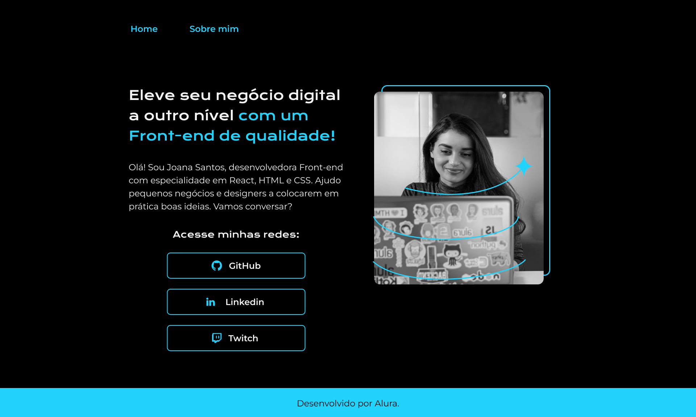

<h1 align="center"> Portfolio Dan V2 </h1>

Programa de exercício proposto pela Alura no curso de formação de Front-end módulo 2 
<a href="https://www.figma.com/file/0sHX72vfT4sspU9FunajsC/Portfolio-Projeto-2-(Copy)?node-id=1%3A47&mode=dev">Estude esse projeto clicando aqui.</a>

  <a href="#-tecnologias">Tecnologias</a>&nbsp;&nbsp;&nbsp;|&nbsp;&nbsp;&nbsp;
  <a href="#-projeto">Projeto</a>&nbsp;&nbsp;&nbsp;|&nbsp;&nbsp;&nbsp;
  <a href="#-layout">Layout</a>&nbsp;&nbsp;&nbsp;|&nbsp;&nbsp;&nbsp;
  <a href="#memo-licença">Licença</a>

 

  

## 🚀 Tecnologias

Esse projeto foi desenvolvido com as seguintes tecnologias:

- HTML e CSS
- Git e Github
- Figma

## 💻 Projeto

O Portfolio é usado como forma de disponibilizar o Github e LinkedIn do desenvolvedor.

- [Acesse o projeto finalizado, online](https://github.com/daduara/portfoliodan)

## 🔖 Layout

Você pode visualizar o layout do projeto através [DESSE LINK](<https://www.figma.com/file/0sHX72vfT4sspU9FunajsC/Portfolio-Projeto-2-(Copy)?node-id=1%3A47&mode=dev>). É necessário ter conta no [Figma](https://figma.com) para acessá-lo.

## Licença

Esse projeto está sob a licença MIT.
# portfoliodanV2
